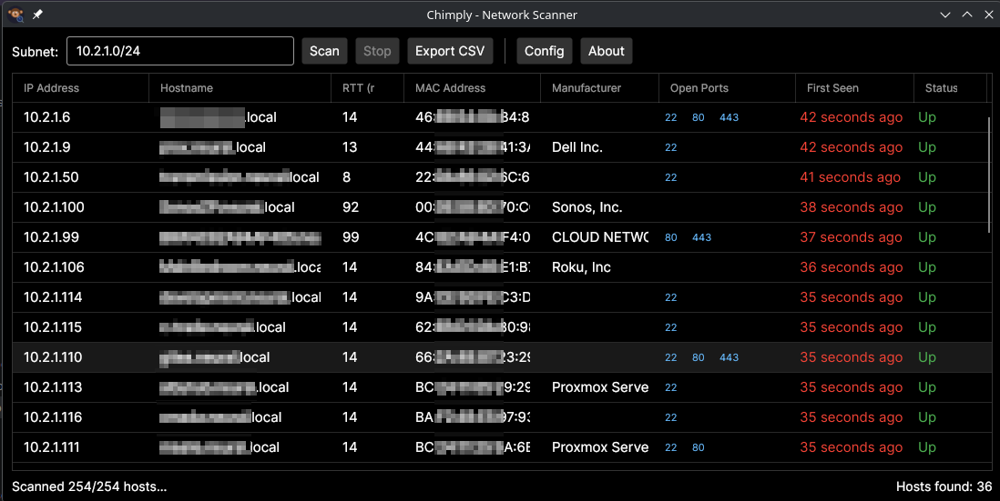

<p align="center">
  
</p>

<h1 align="center">Chimply</h1>

<p align="center">A cross-platform network scanner built with .NET 8 and Avalonia UI.</p>

---



## Features

- **ICMP ping** with TCP port probe fallback for host discovery
- **Port scanning** (21, 22, 80, 443) with clickable links that open in the default handler
- **MAC address resolution** (Windows via SendARP, Linux via /proc/net/arp)
- **Manufacturer lookup** from IEEE OUI database (~57K entries)
- **Auto-detect subnet** from the primary network adapter
- **Persistent results** across scans with New/Up/Down status tracking
- **Color-coded "First Seen"** timestamps with live updates
- **Export CSV** for scan results
- **Numeric IP sorting** in the DataGrid
- Dark Fluent theme

## Building

Requires [.NET 8 SDK](https://dotnet.microsoft.com/download/dotnet/8.0).

```bash
dotnet build Chimply.sln
dotnet run --project Chimply/Chimply.csproj
```

## Publishing

Single-file self-contained binaries can be built using the included publish profiles:

```bash
# Linux
dotnet publish Chimply/Chimply.csproj -p:PublishProfile=linux-x64

# Windows
dotnet publish Chimply/Chimply.csproj -p:PublishProfile=win-x64
```

Output will be in `Chimply/bin/Release/net8.0/<rid>/publish/`.

## Updating the OUI Database

Replace `Chimply/Resource/mac.csv` with a newer version from [maclookup.app](https://maclookup.app/downloads/csv-database) and rebuild.

## License

This project is licensed under the [GNU General Public License v3.0](LICENSE).
